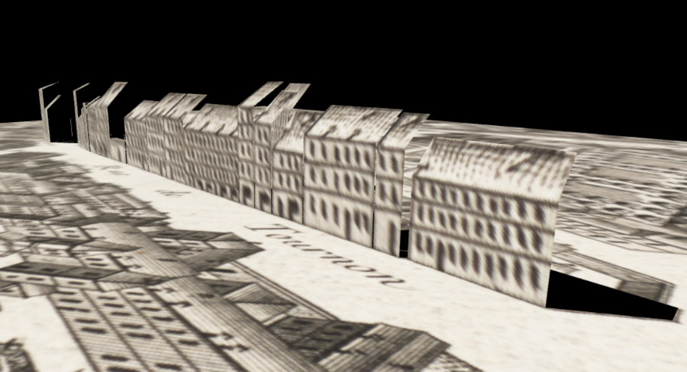

# BET3D
## Building Elevation for Turgot map in 3D

The project can be visualized at : [victoroxbr.github.io/BET3D](https://victoroxbr.github.io/BET3D/).

A video can also be visualized at : .

## Context
This project takes place in the Web 3D lesson of the TSI course at the [ENSG](http://www.ensg.eu). The [IGN](http://www.ign.fr) wants to create a 3D view from the [Turgot map](https://fr.wikipedia.org/wiki/Plan_de_Turgot#/media/Fichier:Turgot_map_of_Paris_-_Norman_B._Leventhal_Map_Center.jpg) of Paris.

There is a previous project realised by ENSG students on this page : [BET3D](https://github.com/MarieStretti/BET3D).

The new objectives are:
* Add roof edges in the modelisation
* Animate the appearance/disappearance of the buildings in 3D mode
* Differenciate the animation of the building and the roof

## Development

### Hypothesis and decisions

To complete the objectives, we had to make some decision:
* The buildings height in 2D is computed from the distance between the bottom of the building and the top of its facade in the map image.
* The map was not really holed when the building are lifted up. Indeed, a set of black polygons are drawn over the map in order to hide the
facades.

### Process

The steps of the project were:
1. Creating a sample of edges with QGIS:
    * There are three types of edges: `ground_edges`, `sky_edges` and `roof_edges` (cf [schema](./images/edges_schema.png))
    * The json files of those geometries are in the folder [edges](./edges)
3. Implementing the application:
    1. Loading the GeoJSON
    2. Creating a geometry roof for the map in 2D
    3. Creating a geometry roof for the buildings in 3D

    4. Implementing functionnalities:
        * rotation of the buildgins on clicking on the `mode_3D` button (on/off)
        * differenciate roof and building animation

The protocols of this process are explained in the [protocols.md](./protocols.md) file.

## Authors
* Hoang-Viet Nguyen: 
   * GitHub: @reinereina
   * GitLab: @nguyhv25
* Victor Oxombre:
   * GitHub: @victoroxbr
   * GitLab: @oxbr
